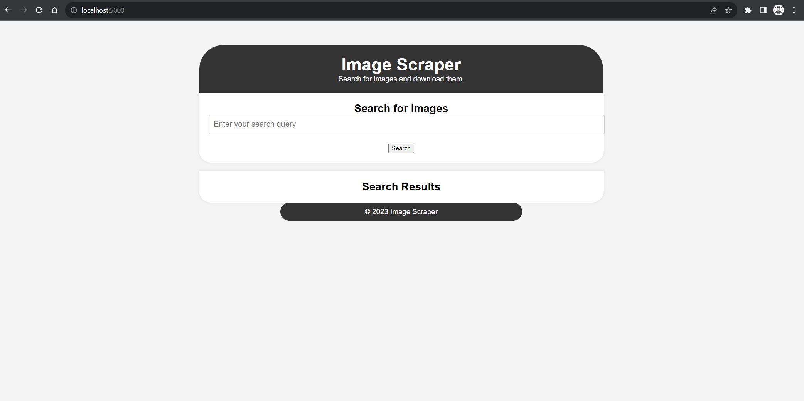

# **`Image Scraping Project`**




* ## **What is this project?**

 ### This project is used to scrape images of any thing and save them to a local directory.


* ## Applications Used
1. [Python 3.x](https://www.python.org/)
2. [Anaconda](https://www.anaconda.com/)
3. [VSCodeIDE](https://code.visualstudio.com/)
4. [Github](https://github.com)

* ## **How to setup ?**
1. ## Create a new environment
```
conda create --name scrape python==3.8 -y
```
2. ## Activate the newly created environment
```
conda activate scrape
```
3. ## Install the requirements
```
pip install -r requirements.txt
